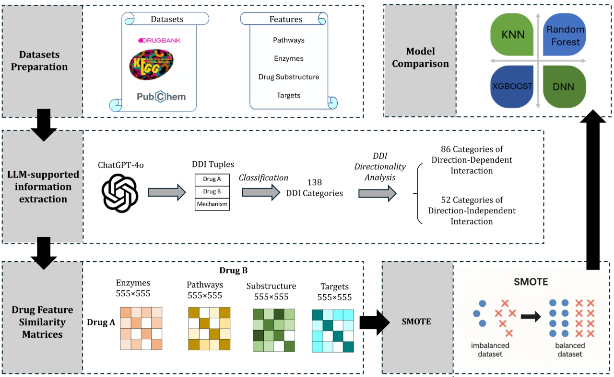

# Drug-drug-interaction-prediction
Use similarity-based machine learning approach to predict drug-drug interactions

## Workflow Overview
Below shows the graphic abstract of the overall workflow:

  

# Requirements
To run this notebook, the following dependencies must be installed:

Python (version 3.7+)
Common Python libraries:
pandas
numpy
matplotlib
seaborn
scikit-learn (if machine learning-related transformations are included)

# Manipulation
It contains scripts to modify four input features of drugs (Target, Enzyme, Pathway, Substructure). Features are extracted from DrugBank, PubMed, Kegg. Then, the features are done with one-hot encoding and Jaccard Similarity matrix calculation to uniform the input size to 556*556. This file mainly focuses on the data preprocessing part. Details are explained in the comment part in the .ipynb file

# Encoder
This file uses the sentence transformer to translate drug-drug interaction descriptions to vectors. Then, k-means cluster is applied to group the description into categories based on the embedding space.

# Feature Analysis
It contains the method to investigate the best combination of drug features that causes the best prediction results.

# DDI Model Running and Evaluation
This file documents the model running for KNN, RF, XGBOOST, DNN with and without SMOTE oversampling. Then, the plot of AUPR across models and the confusion matrix are provided to visualize the results.

# ADASYN+Attention
This file uses ADASYN to oversample the dataset and records that the effect of ADASYN was much worse than using SMOTE. Also, an attention mechanism is applied to evaluate the top influential factors of the model, which corresponds to the pharmacological explanations

# Author
Created by: Qiuyang Feng

Contact: frankfeng1202@gmail.com
